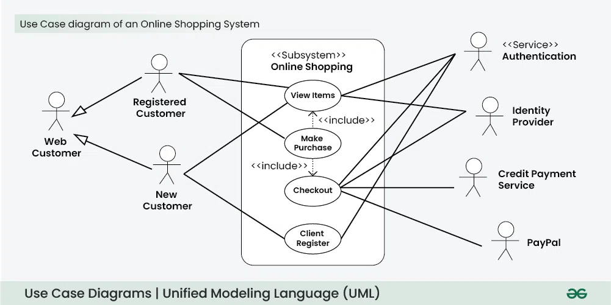

Class Diagram:
Represented as rectangles, classes are divided into three compartments, divided by 2 lines:

Name: The unique identifier of the class.
Attributes: The properties or data associated with the class 
Methods: The actions or methods 

Visibility Markers: 
+(Public): The attribute or method is accessible from any class.
-(Private): The attribute or method is only accessible within the same class.
#(Protected): The attribute or method is accessible within the same class and its subclasses.
~(Default): The attribute or method is accessible within the same package.

Multiplicity:
[1]  - Exactly One
[0..1] - Zero or One
[*] - Zero or Many
[1..*] - One or Many

Attributes Format:
visibility name: type [multiplicity] = defaultValue
Multiplicity Indicates how many instances of the type are allowed.
Ex: -email: String [0..1]

Methods Format:
visibility name(parameter): returnType
EX: +execute(x: int): void

Interface: Class rectangle with the keyword «interface» above the interface name. Both in italics.
Abstract Class: Class rectangle with the keyword «abstract» above the class name. Both in italics.

Relationships:
Association: Solid line with arrow (Unidirectional - Arrow point to referenced class), No arrow (Bidirectional)
Dependency: Dashed line with arrow head, arrow points to referenced Class
Aggregation: Solid line with hollow diamond head. Arrow goes from part to whole. 
Composition: Solid line with filled diamond head. Arrow goes from part to whole.
Inheritance: Solid Line with hollow triangle head. Arrow goes from Child to Parent.
Realization (Implementation): Dashed line with hollow triangle head. 

Use Case Diagram: Representation of how different users (actors) interact with a system.

Actor: Anything that interacts with the system from outside. (users/systems/services)
Represented by Stick Figure with name of the actor.

Use Case: Functionality that the system provides to the actor.
Represented by Oval with name of use case inside.

System boundary: Defines what’s inside the system and what’s outside.
Labeled box that encloses use cases.

Relationships:
Association: Connects an actor to a use case. Solid Line. Ex: "Customer" does "Transfer Funds".
Include: Represents common functionality shared between use cases. Dashed arrow with label <<include>>. Ex: Checkout includes Payment. 
Extend: Represents optional or conditional behavior. Dashed arrow with label <<extend>>. Ex: "Select Seat" extends "Flight Booking"
Generalization: inheritance (parent-child relationship) between actors or use cases. Triangle arrowhead from child to parent. One use case is a specialized version of another. It is represented by an arrow pointing from the specialized use case to the general use case.

